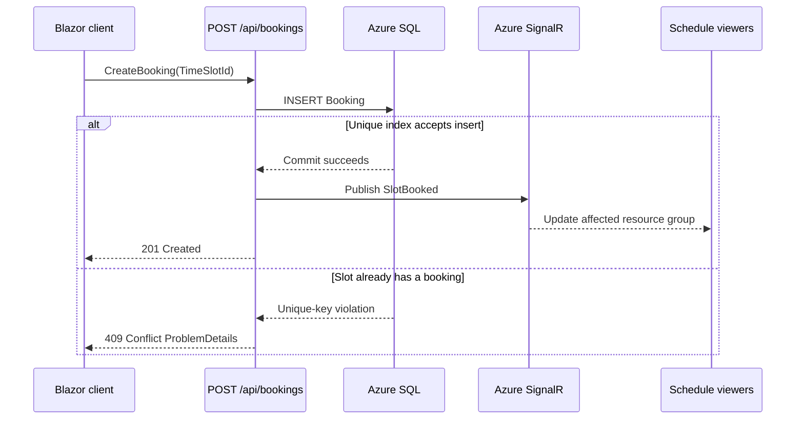

# Architecture documentation

The system is documented with the C4 model: the diagrams move from the users and system boundary down to deployable containers, implementation components, and the Azure deployment view.

For product workflows, roles, AI booking, and troubleshooting, see the [Roomly User and Administrator Guide](../user-guide.md). For AI provider setup and booking safeguards, see the [AI-assisted booking guide](../ai-assisted-booking.md).

| View | File | Main question |
|---|---|---|
| C1 — System Context | [c4-context.md](c4-context.md) | Who uses RoomBooking, and which external systems does it depend on? |
| C2 — Containers | [c4-container.md](c4-container.md) | Which runtime containers and data stores make up the application? |
| C3 — Components | [c4-component.md](c4-component.md) | How do the UI clients, API features, persistence, and realtime notifications fit together? |
| C4 — Deployment | [c4-deployment.md](c4-deployment.md) | How are the containers provisioned and connected in Azure? |

Diagrams use Mermaid and can be viewed in GitHub, compatible Markdown editors, or the repository's project documentation links in the main application. Keep these views consistent with `README.md`, `docs/specs/meeting-room-system.md`, and the Bicep modules when architecture changes.

## Key runtime decisions

- The Blazor WebAssembly client and ASP.NET Core API are served from one App Service origin. Its typed C# clients own HTTP and SignalR communication.
- Booking commands use HTTP. The database unique index on `Booking.TimeSlotId` is the final authority; SignalR sends `SlotBooked` only after persistence succeeds.
- Azure SQL, Azure SignalR, Application Insights, and Key Vault are provisioned through Bicep. Local development can use the in-memory provider and built-in SignalR.
- The optional AI assistant is a server-side integration. Availability proposals are read-only; an explicit booking command enables a narrowly scoped action that verifies an exact future slot and persists through the same unique-index-protected database invariant. Users can cancel only their own future bookings.
- See the [AI-assisted booking guide](../ai-assisted-booking.md) for user instructions, provider configuration, guardrails, cancellation, and verification.

## Interactive OpenAPI / Swagger reference

Run the host in Development:

```bash
dotnet run --project src/Server/RoomBooking.Server.csproj
```

- Swagger UI: [`/swagger`](https://localhost:7274/swagger)
- OpenAPI JSON: [`/openapi/v1.json`](https://localhost:7274/openapi/v1.json)

Swagger UI and the OpenAPI document are deliberately exposed only in Development. The reference documents endpoint groups, DTOs, summaries, validation and expected response codes, including `409 Conflict` for competing bookings. Since the API uses same-origin Identity cookies, use the login endpoint in Swagger UI before trying authenticated operations; the browser will send the resulting cookie with same-origin requests. Admin routes require the `Admin` role.

## Booking request sequence

