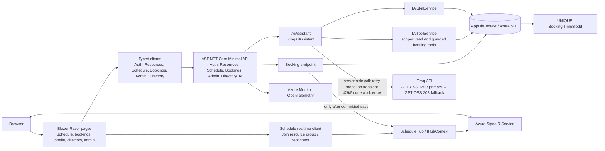

# C4 — Components (C3)

## Booking core

Booking creation uses the existing API flow in `Program.cs` or the guarded AI `book_slot` tool. Both attempt an insert protected by the unique `IX_Bookings_TimeSlotId_Unique` database index. A duplicate-key failure becomes a conflict; SignalR publishes only after persistence succeeds. The AI tool is available only for an explicit booking command and derives the user ID from the authenticated request.

## AI feature

`IAiAssistant` hides provider use. `GroqAiAssistant` keeps API credentials on the server and imposes a bounded tool-call loop. The normal allowlist contains `get_resources`, `get_schedule`, `get_my_bookings`, `get_booking_policy`, and the read-only `propose_booking`; `book_slot` is added only when `BookingIntentDetector` recognizes an explicit booking instruction. The server converts the requested local date/time using the browser time zone and requires an exact future slot match before attempting the insert. The database unique index remains authoritative under races. The personal-bookings tool receives the authenticated user's server-derived ID. Skills are untrusted supplemental text and cannot add tools.

Successful AI-created bookings set `Booking.IsAiGenerated`, which drives the “Booked by AI” badge. Users can cancel their own future bookings through `DELETE /api/bookings/{id}`; after deletion commits, `SlotCancelled` updates viewers of that resource. The AI tool cannot cancel bookings.

`SkillUploadParser` validates UTF-8 `.md`, `.txt`, or `.json` content in memory. It never writes uploaded content to disk or executes it. Upload and AI generation return drafts; saving creates an inactive skill and a separate admin action activates it.

## OpenAPI

The ASP.NET Core OpenAPI generator produces `/openapi/v1.json`; Swashbuckle's Swagger UI is served at `/swagger` in Development. Endpoint groups and representative operations carry summaries, descriptions, DTO response schemas, validation responses, and authorization/conflict status codes. The API uses same-origin Identity cookies; sign in through the documented login endpoint when trying authorized operations from the UI. Admin endpoints require the `Admin` role. Neither the document nor the UI is mapped in Production.

See [architecture overview and usage instructions](README.md) for the C1–C4 diagram index and a request-sequence view of the concurrency guarantee.
