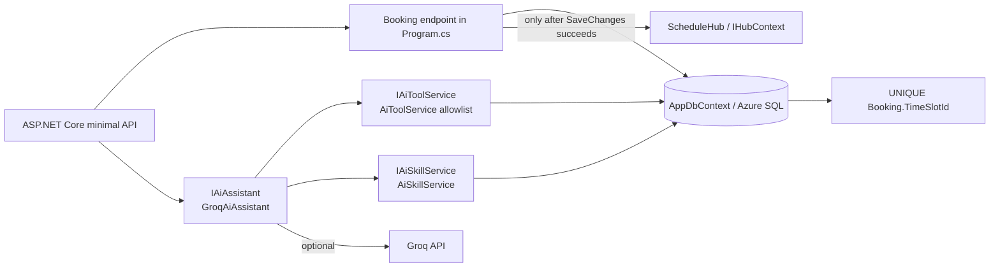

# C4 — Components (C3)

## Booking core

Booking creation remains the existing API flow in `Program.cs`. It attempts the insert and relies on the unique `IX_Bookings_TimeSlotId_Unique` database index. A duplicate-key failure becomes HTTP 409. SignalR publishes only after persistence succeeds. The AI subsystem has no booking command/tool and cannot inject or invoke the booking endpoint.

## AI feature

`IAiAssistant` hides provider use. `GroqAiAssistant` keeps API credentials on the server, imposes a bounded tool-call loop, and exposes only `get_resources`, `get_schedule`, `get_my_bookings`, and `get_booking_policy`. Calls run through `IAiToolService`; the personal-bookings tool receives the authenticated user's server-derived ID. The tool service has read-only query behavior. Skills are text stored through `IAiSkillService`; they're supplied as untrusted supplemental prompt data and cannot add tools.

`SkillUploadParser` validates UTF-8 `.md`, `.txt`, or `.json` content in memory. It never writes uploaded content to disk or executes it. Upload and AI generation return drafts; saving creates an inactive skill and a separate admin action activates it.

## OpenAPI

Swashbuckle serves the document and Swagger UI in Development at `/swagger`. AI and booking endpoint summaries, response codes, authorization expectations and validation outcomes are described through minimal API metadata. Swagger is not enabled publicly in Production.
