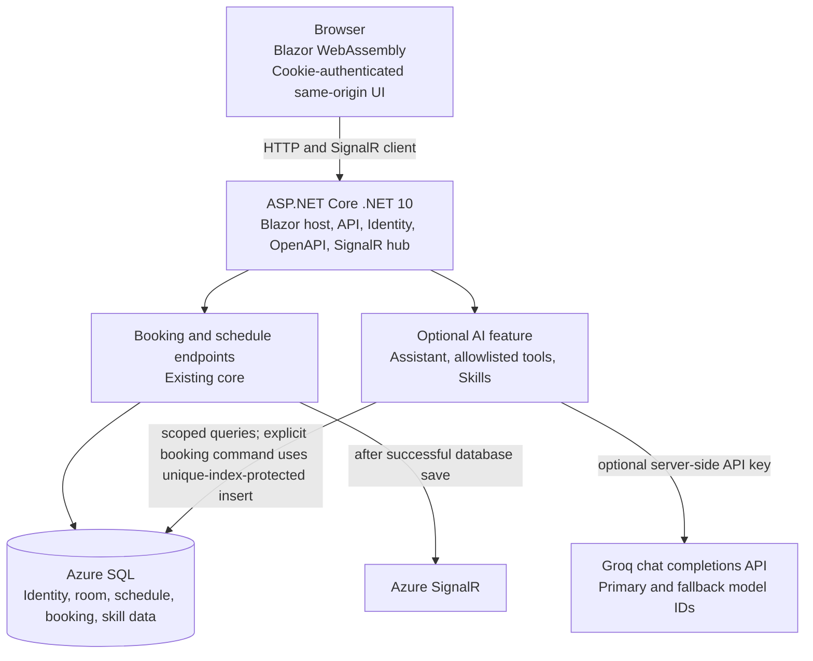

# C4 — Containers (C2)

```mermaid
flowchart TB
    browser[Browser\nBlazor WebAssembly\nCookie-authenticated same-origin UI]
    web[ASP.NET Core .NET 10\nBlazor host, API, Identity, OpenAPI, SignalR hub]
    booking[Booking and schedule endpoints\nExisting core]
    ai[Optional AI feature\nAssistant, allowlisted tools, Skills]
    sql[(Azure SQL\nIdentity, room, schedule, booking, skill data)]
    signalr[Azure SignalR]
    groq[Groq chat completions API\nPrimary and fallback model IDs]
    browser -->|HTTP and SignalR client| web
    web --> booking
    web --> ai
    booking --> sql
    booking -->|after successful database save| signalr
    ai -->|scoped queries; explicit booking command uses unique-index-protected insert| sql
    ai -->|optional server-side API key| groq
```

The primary client is `src/Client/RoomBooking.Client`, hosted by the ASP.NET Core app on one origin. The legacy static AI workspace remains available at `/index.html`.
