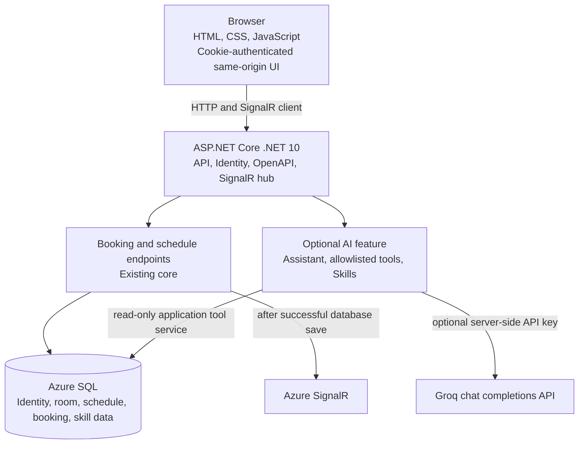

# C4 — Containers (C2)

The checked-in repository currently serves a static same-origin browser application from `src/Server/wwwroot`; it does **not** contain a Blazor Web App or Interactive WebAssembly client. This diagram describes the implementation that exists. No parallel Blazor application is represented as shipped functionality.
