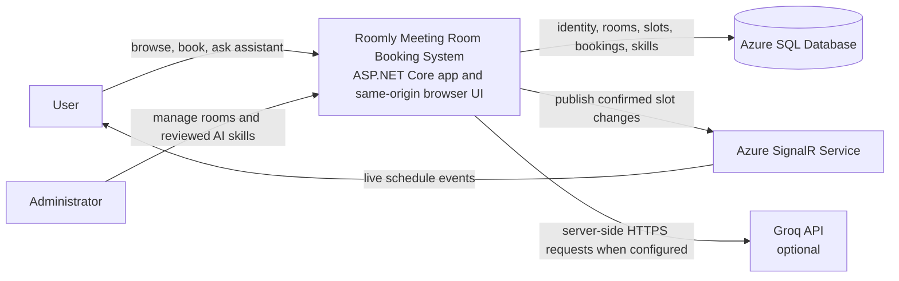

# C4 — System Context (C1)

```mermaid
flowchart LR
    user[User]
    admin[Administrator]
    app[Roomly Meeting Room Booking System\nASP.NET Core app and same-origin browser UI]
    sql[(Azure SQL Database)]
    signalr[Azure SignalR Service]
    groq[Groq API\noptional]
    user -->|browse, book, ask assistant| app
    admin -->|manage rooms and reviewed AI skills| app
    app -->|identity, rooms, slots, bookings, skills| sql
    app -->|publish confirmed slot changes| signalr
    app -->|server-side HTTPS requests when configured| groq
    signalr -->|live schedule events| user
```

The assistant is optional. Groq is reached only by the server. Booking correctness does not depend on it.
