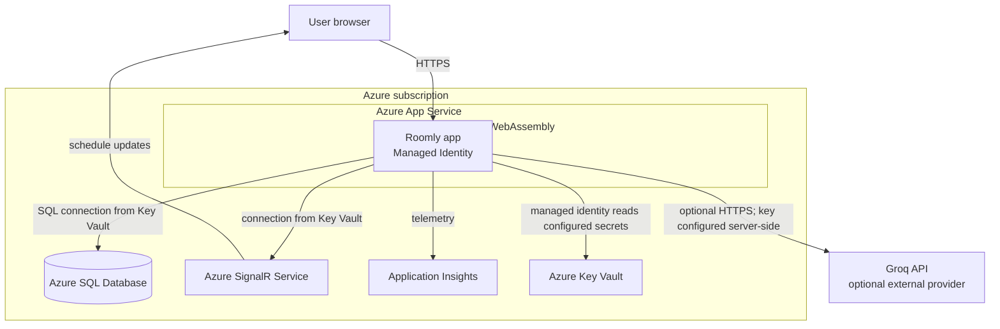

# C4 — Deployment

Infrastructure is described by `infra/main.bicep` and its modules. Groq is not provisioned by the Bicep template: configure `GROQ_API_KEY` and optionally `GROQ_MODEL` as App Service settings backed by Key Vault or GitHub environment secrets. If unset, AI endpoints report unavailable while booking remains usable. Swagger UI is Development-only. This diagram describes the deployed target; it does not imply that Azure resources have been provisioned for this repository.
